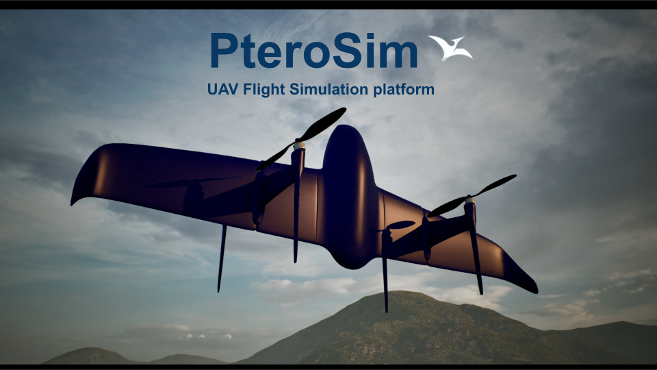

<h1 align="center">
  PteroSim
</h1>

  <b>UAV Simulation platform</b> 
  PX4 & ArduPilot SITL · Programmable API · Multi-vehicle support

  
  
  
  

  <a href="https://www.youtube.com/watch?v=4QMwmZL_3O4">Watch Demo</a> ·
  <a href="https://pterolabs.ai">Website</a> ·
  <a href="https://github.com/PteroLabsAI/PteroSim-UAV-Simulator/releases">Download</a> ·
  <a href="#quick-start">Quick Start</a> ·
  <a href="mailto:info@pterolabs.ai">Contact</a>

---

  

## About

PteroSim is a UAV simulation platform for drone development, testing, and research. Accurate 6-DOF flight dynamics, native **PX4** and **ArduPilot** SITL support, and a full programmatic API.

## Features

- 6-DOF flight dynamics, up to 10x real-time
- Wind and turbulence modeling
- PX4 and ArduPilot SITL
- IMU, GPS, barometer, airspeed, camera
- Programmatic API for multi-drone orchestration
- Python SDK: `pip install pterosim`

## Vehicles

<table>
  <tr>
    <td align="center">
       
      <b>Quadcopter</b> 
      PX4 · ArduPilot · Betaflight
    </td>
    <td align="center">
       
      <b>Helicopter</b> 
      PX4 · ArduPilot
    </td>
  </tr>
  <tr>
    <td align="center">
       
      <b>VTOL</b> 
      PX4 · ArduPilot
    </td>
    <td align="center">
       
      <b>Coaxial Helicopter</b> 
      ArduPilot
    </td>
  </tr>
  <tr>
    <td align="center">
       
      <b>Fixed-Wing</b> 
      PX4 · ArduPilot
    </td>
    <td align="center">
       
      <b>Tailsitter</b> 
      PX4 · ArduPilot
    </td>
  </tr>
</table>

## Getting Started

Download the latest release from [GitHub Releases](https://github.com/PteroLabsAI/PteroSim-UAV-Simulator/releases), extract, and run `PteroSim.exe`. See the [documentation](https://pterosimdocs.readthedocs.io/en/latest/) for setup guides and API reference.

## System Requirements

| | Minimum | Recommended |
|---|---------|-------------|
| **OS** | Windows 10 64-bit / Ubuntu 22.04 | Windows 11 / Ubuntu 24.04 |
| **CPU** | Quad-core, 2.5 GHz | 6+ cores, 3.0+ GHz |
| **RAM** | 8 GB | 16 GB |
| **GPU** | GTX 770 / RX 570 | RTX 2070+ / RX 5700+ |
| **Storage** | 5 GB | 10 GB SSD |

## Documentation

Full documentation at [pterolabs.ai](https://pterolabs.ai).

<!-- TODO: Uncomment when docs pages are live
- [Getting Started](https://pterolabs.ai/docs/getting-started)
- [API Reference](https://pterolabs.ai/docs/api)
- [PX4 Integration](https://pterolabs.ai/docs/px4)
- [ArduPilot Integration](https://pterolabs.ai/docs/ardupilot)
- [Custom Airframes](https://pterolabs.ai/docs/custom-airframes)
-->

## License

PteroSim is proprietary software by [PteroLabs AI](https://pterolabs.ai).  
Free for non-commercial, personal, and academic use. See [LICENSE](LICENSE) for details.

---

  &copy; 2026 PteroLabs AI

