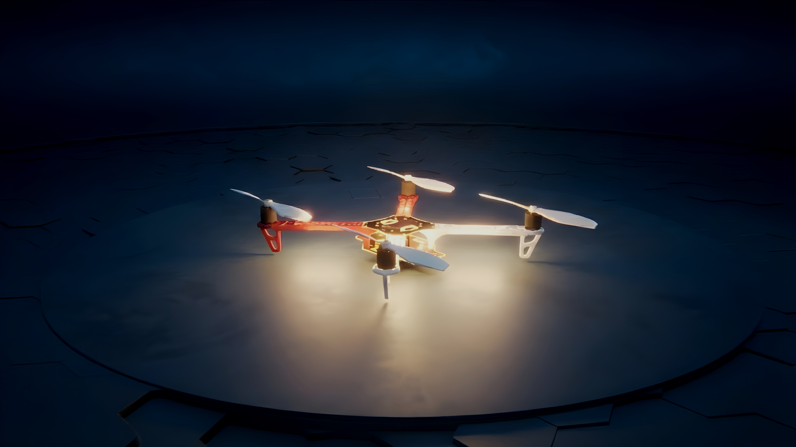

<p align="center">
  
</p>

<h1 align="center">
  PteroSim
</h1>

<p align="center">
  <b>High-fidelity UAV simulator built on Unreal Engine 5</b><br>
  <sub>JSBSim 6-DOF physics · PX4 & ArduPilot SITL · gRPC API</sub>
</p>

<p align="center">
  <a href="https://github.com/PteroLabsAI/PteroSim-UAV-Simulator/releases">
    
  </a>
  <a href="#license">
    
  </a>
  <a href="https://www.youtube.com/@PteroLabsAI">
    
  </a>
</p>

<p align="center">
  <a href="https://www.youtube.com/watch?v=4QMwmZL_3O4">Watch Demo</a> ·
  <a href="https://pterolabs.ai">Website</a> ·
  <a href="https://github.com/PteroLabsAI/PteroSim-UAV-Simulator/releases">Download</a> ·
  <a href="#quick-start">Quick Start</a>
</p>

---

<!-- TODO: Replace with actual screenshots/GIFs -->
<p align="center">
  
</p>

## About

PteroSim is a standalone UAV flight simulator for drone development, testing, and research. It uses **JSBSim 6-DOF flight dynamics** for accurate physics and connects natively to **PX4** and **ArduPilot** autopilots via MAVLink.

Free to use. Full gRPC API included. No strings attached.

## Features

<table>
  <tr>
    <td width="50%">

**Flight Dynamics**
- JSBSim 6-DOF aerodynamic simulation
- 6x to 10x faster than real-time
- Wind and turbulence modeling

</td>
    <td width="50%">

**Flight Stacks**
- PX4 SITL with MAVLink lockstep
- ArduPilot SITL, no middleware
- OFFBOARD, missions, manual control

</td>
  </tr>
  <tr>
    <td width="50%">

**Sensors**
- IMU, GPS, barometer, airspeed
- Camera (via API)
- Extensible sensor framework

</td>
    <td width="50%">

**API & Automation**
- Full gRPC API
- Spawn, control, read telemetry
- Multi-drone orchestration

</td>
  </tr>
</table>

## Vehicle Types

<!-- TODO: Replace with screenshots or GIF showing all vehicle types -->
<p align="center">
  
</p>

<p align="center">
  <b>Multi-Rotor</b> · <b>Helicopter</b> · <b>VTOL</b> · <b>Fixed-Wing</b>
</p>

## Quick Start

**1. Download** the latest release from [GitHub Releases](https://github.com/PteroLabsAI/PteroSim-UAV-Simulator/releases).

**2. Extract and run** `PteroSim.exe`.

**3. Connect your autopilot:**

```bash
# PX4
cd PX4-Autopilot
make px4_sitl none_iris
# Connects automatically on TCP 4560

# ArduPilot
sim_vehicle.py -v ArduCopter -f json --console --map
```

**4. (Optional) Use the API:**

```python
import grpc
from pterosim import simulator_pb2, simulator_pb2_grpc

channel = grpc.insecure_channel('localhost:50051')
stub = simulator_pb2_grpc.SimulatorStub(channel)
stub.SpawnDrone(simulator_pb2.SpawnRequest(airframe="F450"))
```

## System Requirements

| | Minimum | Recommended |
|---|---------|-------------|
| **OS** | Windows 10 64-bit | Windows 11 64-bit |
| **CPU** | 4 cores, 3.0 GHz | 8+ cores, 3.5+ GHz |
| **RAM** | 8 GB | 16 GB |
| **GPU** | GTX 1060 / RX 580 | RTX 3070+ / RX 6800+ |
| **Storage** | 5 GB | 10 GB (SSD) |

## Documentation

Full documentation at [pterolabs.ai](https://pterolabs.ai).

<!-- TODO: Uncomment when docs pages are live
- [Getting Started](https://pterolabs.ai/docs/getting-started)
- [gRPC API Reference](https://pterolabs.ai/docs/api)
- [PX4 Integration](https://pterolabs.ai/docs/px4)
- [ArduPilot Integration](https://pterolabs.ai/docs/ardupilot)
- [Custom Airframes](https://pterolabs.ai/docs/custom-airframes)
-->

## Contact

| | |
|---|---|
| **Website** | [pterolabs.ai](https://pterolabs.ai) |
| **YouTube** | [@PteroLabsAI](https://www.youtube.com/@PteroLabsAI) |
| **LinkedIn** | [PteroLabs](https://www.linkedin.com/company/pterolabs) |
| **Email** | info@pterolabs.ai |

## License

PteroSim is proprietary software by [PteroLabs AI](https://pterolabs.ai).  
Free for non-commercial, personal, and academic use. See [LICENSE](LICENSE) for details.

---

<p align="center">
  <sub>Built with Unreal Engine 5 · JSBSim · PX4 · ArduPilot</sub><br>
  <sub>&copy; 2026 PteroLabs AI</sub>
</p>
